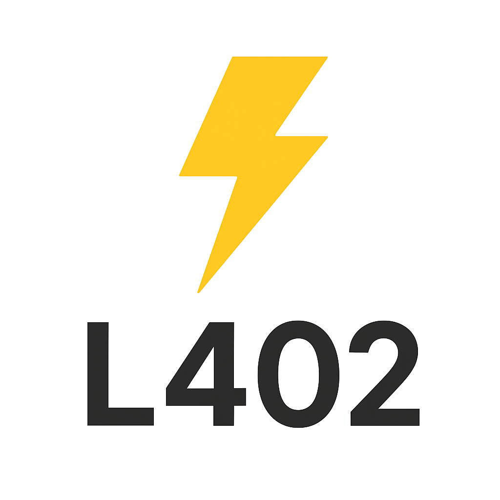

#   L402 Middleware for Rails

#### ⚡ Boltwall for Rails: seamless L402 paywalls and API monetization with Lightning

**L402 Middleware** is a Ruby gem that seamlessly integrates with your Rails application, enabling [L402](https://docs.lightning.engineering/the-lightning-network/l402) protocol functionality. Build microservices, APIs, or payment gateways with **pay-per-request authentication** using the Lightning Network — effortlessly.

---

## 🚀 Key Features

- **Plug-and-Play**: Integrate with Rails with just a single line of configuration.  
- **Lightning Network Ready**: Enforces payment and authentication standards based on L402.  
- **Highly Configurable**: Customize request handling, payments, and caveats.  
- **Lightweight & Fast**: Minimal dependencies for optimal performance.  

---

## 🛠️ Installation

Add the gem to your application's `Gemfile`:

```ruby
gem 'l402_middleware'
```

Then install:

```bash
bundle install
```

---

## ⚙️ Configuration

1. **Add the middleware** to your Rails stack in `application.rb`:

```ruby
# config/application.rb
config.middleware.use L402Middleware, config.l402_middleware
```

2. **Define configuration options**:

```ruby
config.l402_middleware = {
  network_type: :lnd,
  root_key: 'your_root_key',
  caveats: [],
  lnd: {
    address: '<lnd-node-address>',
    tls_certificate_path: '<tls-cert-path>',
    macaroon_path: '<macaroon_path>'
  },
  invoice: {
    millisatoshis: 100,
    description: 'Payment required to access the API',
    payable: 'once'  # or 'indefinitely'
  },
  endpoints: ['/protected'] # Endpoints to protect with L402 paywall
}
```

---

## 📖 Usage

Once configured, the middleware will:

- Inspect incoming HTTP headers for L402-compliant payment tokens.  
- Validate the token with the configured validator.  
- Reject requests that don’t meet the payment threshold with **HTTP 402 Payment Required**.  

### Example Request Flow

1. Client sends a request:

```
GET /protected-resource HTTP/1.1
Host: example.com
Authorization: L402 <token>
```

2. Middleware validates the token and processes payment.  

3. Rails app continues processing if the payment is successful.  

---

## 🔧 Development

Clone the repository:

```bash
git clone https://github.com/rits1272/l402_middleware.git
cd l402_middleware
```

Run tests:

```bash
bundle exec rspec
```

---

## 📫 Contact & Support

If you have questions, feedback, or need support:

- **Email**: ritikjain1272@gmail.com  
- **Twitter**: [Ritik Jain](https://x.com/Rits1272)

Bring the power of the Lightning Network to your Rails apps in minutes. Happy coding! ⚡
